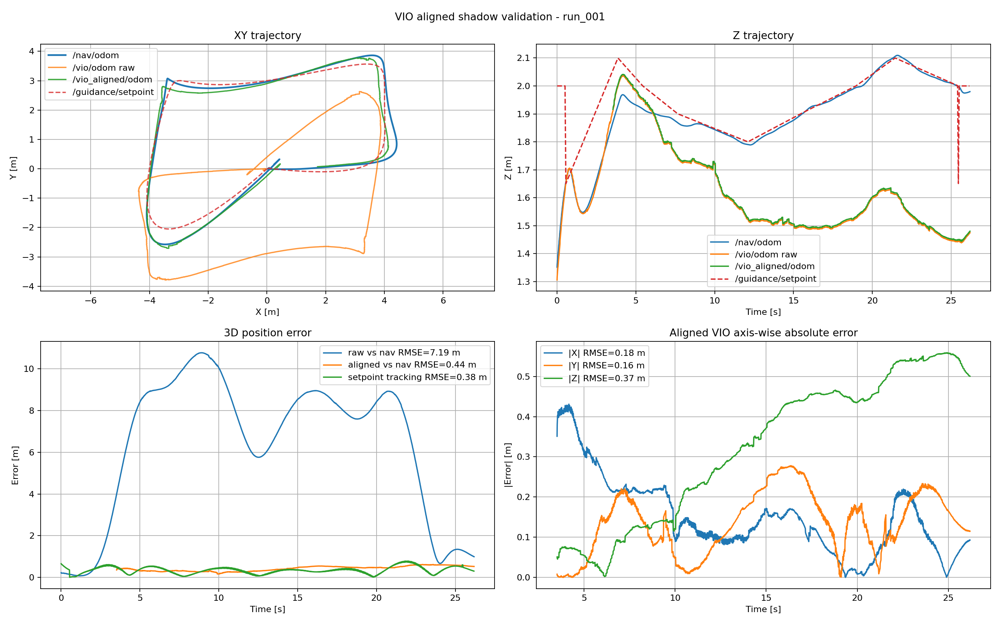
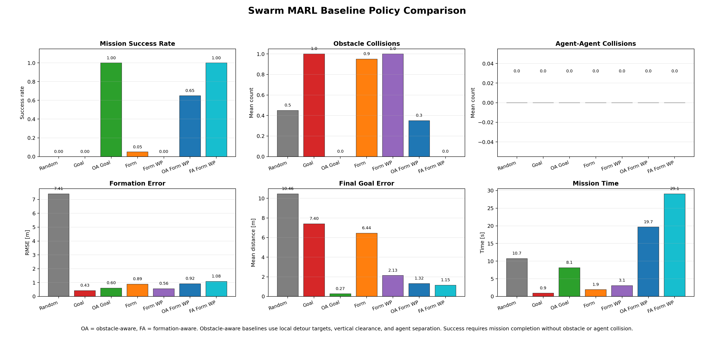
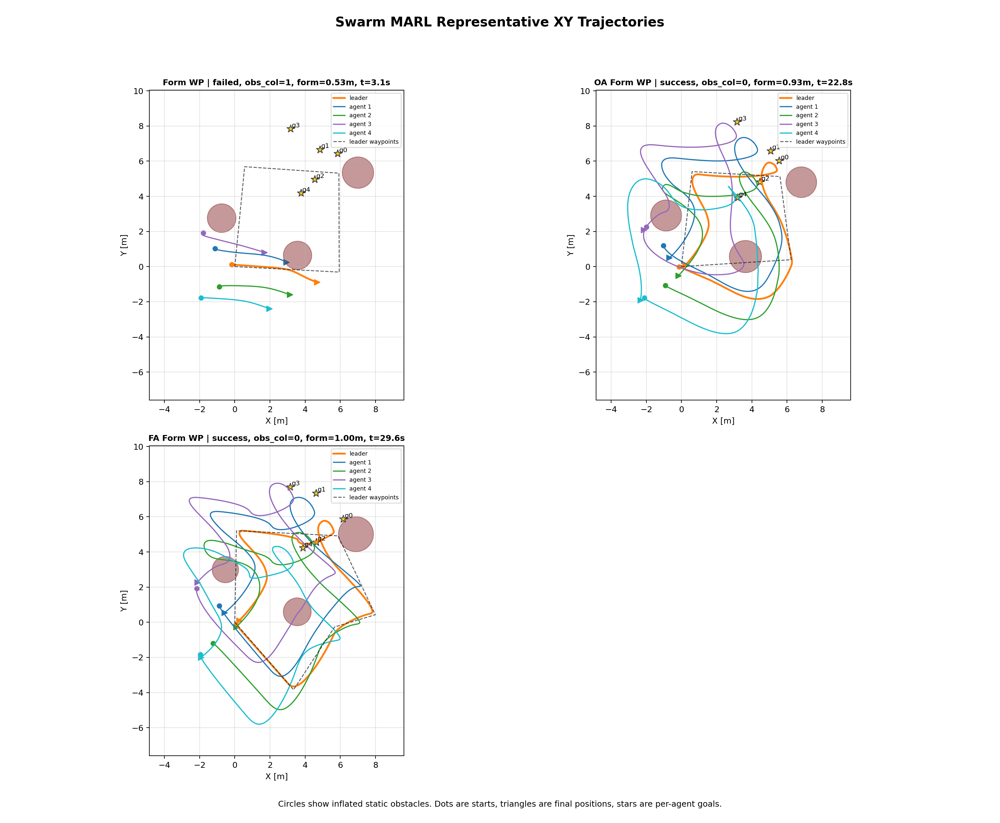

# UAV GNC System — ROS2/PX4-based Autonomous Flight

> **End-to-end Guidance · Navigation · Control** system for unmanned aerial vehicles, built with ROS2 Humble, C++17, PX4 SITL, Gazebo, FAST-LIO2, and OpenVINS.

---

## Overview

This project started as a from-scratch ROS2 UAV GNC stack for studying flight dynamics, state estimation, guidance, planning, and control. It was later extended into a PX4/Gazebo SITL workflow so that the same guidance and navigation ideas can be tested in a production-style flight stack.

Two runtime paths are maintained:

- **Custom GNC simulation path:** custom 6-DOF dynamics, EKF/UKF navigation, D* Lite planning, minimum-snap guidance, and PID/MPC control.
- **PX4 SITL integration path:** Gazebo/PX4 handles vehicle dynamics and low-level control, while this project provides ROS2 guidance, PX4 offboard setpoints, FAST-LIO2/OpenVINS odometry, and PX4 EKF2 external-vision fusion.

**Key highlights:**
- 6-DOF Newton-Euler flight dynamics simulator with RK4 integration
- F450-style multirotor model with rotor thrust allocation, motor lag, yaw torque, and actuator saturation
- 15-State Error-State EKF / UKF fusing IMU, GPS, and LiDAR-derived pose measurements
- Multi-Segment Minimum Snap trajectory generation with QP/KKT-based coefficient solving
- Cascaded PID controller with feedforward and integral disturbance rejection
- Linear MPC (Condensed formulation) with precomputed K_first — 100 Hz real-time
- D* Lite obstacle-aware path planning with 2.5D LiDAR occupancy projection
- PX4 v1.16 + Gazebo Harmonic SITL offboard flight integration
- FAST-LIO2 odometry connection to PX4 EKF2 as external vision
- GPS-denied waypoint flight using LIO horizontal position + barometric height
- OpenVINS stereo-inertial VIO shadow pipeline and GPS-denied PX4 EKF2 position-only fusion
- Multi-UAV swarm autonomy module with formation control, communication delay/dropout, dynamic obstacle avoidance, task allocation, and RViz visualization
- MARL-ready swarm environment with observation/action/reward definitions, scripted baseline policies, randomized scenario evaluation, and policy comparison plots

---

## System Architecture


| Node | Responsibility | Rate |
|------|---------------|------|
| `simulation_node` | 6-DOF UAV dynamics simulation (RK4), generates ground truth `/sim/odom`, IMU, and GPS measurements with noise and disturbance | 100 Hz |
| `virtual_lidar_node` | Generates synthetic 3D LiDAR point cloud from simulated UAV pose and obstacle environment | ~10 Hz |
| `lidar_preprocess_node` | Filters LiDAR point cloud (range, height, voxel downsampling) and publishes `/lidar/points_filtered` | ~10 Hz |
| `lidar_pose_correction_node` | Generates LiDAR-derived pose correction (pseudo-measurement) when sufficient points are available for GPS-denied navigation | ~10 Hz |
| `occupancy_projection_node` | Projects 3D LiDAR points into a 2.5D occupancy grid and publishes obstacle updates for planning | ~10 Hz |
| `path_planner_node` | D* Lite incremental path planner using occupancy grid and current `/nav/odom`, outputs obstacle-aware path `/planning/path` | ~5–10 Hz |
| `navigation_node` | EKF / UKF-based state estimation (IMU prediction + GPS or LiDAR correction), outputs `/nav/odom` | 100 Hz predict / 10 Hz update |
| `guidance_node` | Converts planner path into smooth trajectory using multi-segment minimum-snap and generates reference setpoints | 20 Hz |
| `control_node` | Executes cascaded PID or Linear MPC for trajectory tracking using `/nav/odom` and guidance setpoints | 100 Hz |

### PX4 SITL Runtime Path

```text
PX4 + Gazebo
  -> /fmu/out/vehicle_odometry
  -> px4_odom_converter
  -> /nav/odom
  -> guidance_node
  -> /guidance/setpoint
  -> px4_bridge_node
  -> /fmu/in/trajectory_setpoint
  -> PX4 internal position/velocity/attitude/rate controllers
  -> Gazebo vehicle motion
```

### FAST-LIO2 / PX4 EKF2 Fusion Path

```text
Gazebo LiDAR + IMU
  -> ros_gz_bridge
  -> gazebo_lidar_fastlio_adapter_node / imu_lio_adapter_node
  -> FAST-LIO2
  -> /lio/odom
  -> lio_to_px4_visual_odometry
  -> /fmu/in/vehicle_visual_odometry
  -> PX4 EKF2 external vision fusion
  -> /fmu/out/vehicle_odometry
```

### OpenVINS / PX4 EKF2 Fusion Path

```text
Gazebo stereo camera + IMU
  -> ros_gz_bridge
  -> OpenVINS MSCKF
  -> /vio/odom
  -> vio_odom_aligner_node
  -> /vio_aligned/odom
  -> lio_to_px4_visual_odometry
  -> /fmu/in/vehicle_visual_odometry
  -> PX4 EKF2 external vision fusion
  -> /fmu/out/vehicle_odometry
```

### Swarm Autonomy Runtime Path

```text
swarm_sim_node
  -> /swarm/agent_i/odom
  -> swarm_controller_node / swarm_task_manager_node
  -> /swarm/agent_i/cmd_accel or /swarm/agent_i/mission_goal
  -> swarm_comm_node
  -> communication delay/dropout simulation
  -> swarm_eval_node
  -> formation RMSE, min inter-agent distance, collision metrics
  -> swarm_viz_node
  -> RViz MarkerArray visualization
```

### Swarm MARL Baseline Path

```text
SwarmMARLEnv
  -> multi-agent observation/action/reward/termination
  -> scripted baseline policies
  -> randomized scenario rollouts
  -> CSV summaries and trajectory plots
```

---

## Features

### Navigation — 15-State Error-State EKF
- **State vector:** position (3), velocity (3), attitude error δθ (3), accelerometer bias (3), gyroscope bias (3)
- **Prediction (100 Hz):** IMU-driven system model integration with Jacobian propagation
- **Update (10 Hz):** GPS position measurement, Kalman gain computation, quaternion error injection
- Numerical stability via error-state (δθ) representation — avoids quaternion singularities

### Navigation — EKF / UKF Sensor Fusion
- Supports both Error-State EKF and UKF through a `filter_type` parameter in `navigation.yaml`.
- EKF uses Jacobian-based linearization, while UKF uses sigma-point propagation to handle nonlinear state evolution.
- The navigation node can be configured for GPS-aided, LiDAR-aided, or LiDAR-initialized IMU-only experiments.
- The estimated state is published as `/nav/odom` and used by the planner, guidance, and controller.

### GPS-denied LiDAR-aided Navigation
- Adds LiDAR-derived pose correction as an external measurement source for the EKF/UKF.
- Enables GPS-denied navigation by fusing IMU prediction with LiDAR pose correction.
- Includes an IMU-only comparison mode where the filter is initialized once from LiDAR and then runs without external correction.
- Demonstrates that LiDAR-aided EKF/UKF can maintain bounded localization error when GPS updates are disabled.

### Guidance — Multi-Segment Minimum Snap
- Solves an **8N × 8N** constrained linear system (Eigen HouseholderQR) for N trajectory segments
- Guarantees continuity up to snap (4th derivative) at all intermediate waypoints — no stop-and-go behavior
- **Z-axis decoupled** to linear interpolation to prevent Runge's Phenomenon in altitude
- **Reference Preview** for MPC: publishes future N-step position/velocity array at 20 Hz

### Control — Cascaded PID
- Three-loop cascade: position → velocity → attitude
- Feedforward velocity (v_ref) and acceleration (a_ref) from guidance polynomial
- Integral term with anti-windup for steady-state disturbance rejection
- XY/Z gain separation matching physical decoupled dynamics

### Control — Linear MPC (Condensed Formulation)
- Hover-linearized double integrator model: `x = [px, py, pz, vx, vy, vz]`
- Prediction horizon N = 15, control period dt = 0.01 s
- **Precomputed K_first** (3 × 90): runtime reduces to a single matrix-vector multiply → 100 Hz capable
- XY/Z separated Q/R weights reflecting physical priority differences
- Reference Preview integration: `Xref[k] = trajectory at t + k·dt`
- MPC+I variant: integral compensation term added to handle persistent wind disturbance

### Planning — D* Lite Path Planner
- Implements D* Lite-based incremental path planning for obstacle-aware UAV navigation.
- Uses the current navigation estimate `/nav/odom` as the start state and a configurable goal position from `planner.yaml`.
- Supports dynamic occupancy updates, allowing the planner to regenerate paths when obstacle cells change.
- Publishes the planned path through `/planning/path`, which is then converted into smooth trajectory references by the guidance node.
- Extracts key waypoints from the raw grid path to make the output suitable for minimum-snap trajectory generation.

### Perception — Virtual 3D LiDAR and 2.5D Occupancy Projection
- Implements a virtual 3D LiDAR pipeline connected to the internal 6-DOF simulator.
- Generates point cloud data from the simulated UAV pose and predefined obstacle environment.
- Applies point cloud preprocessing such as range filtering, height filtering, and downsampling.
- Projects 3D LiDAR points into a 2.5D occupancy grid around the UAV flight altitude.
- The 2.5D map representation keeps the planner lightweight while still using 3D LiDAR point cloud information.

### PX4 SITL — Offboard Guidance Integration
- Connects ROS2 guidance setpoints to PX4 offboard control through `px4_msgs`.
- Converts `/guidance/setpoint` from ROS ENU `nav_msgs/Odometry` into PX4 NED `/fmu/in/trajectory_setpoint`.
- Converts PX4 `/fmu/out/vehicle_odometry` into ROS ENU `/nav/odom`.
- Uses `position_velocity` offboard mode so PX4 receives both moving position references and velocity feedforward.
- Keeps the custom controller path available, while PX4 SITL mode uses PX4 internal position/velocity/attitude/rate controllers.

### FAST-LIO2 — LiDAR-Inertial Odometry Integration
- Adds a PX4/Gazebo `x500_lidar` model with LiDAR and IMU sensor topics.
- Bridges Gazebo point cloud and IMU topics into ROS2.
- Converts Gazebo LiDAR point clouds into FAST-LIO2-compatible `/lidar/points_raw`.
- Converts Gazebo IMU messages into `/lio/imu`.
- Runs FAST-LIO2 in shadow mode first, then publishes `/lio/odom` into PX4 EKF2 as external vision odometry.

### OpenVINS — Stereo Visual-Inertial Odometry Integration
- Extends the PX4/Gazebo `x500_lidar` model with a stereo camera rig and VIO IMU feed.
- Bridges Gazebo stereo image, camera info, and IMU topics into ROS2.
- Builds OpenVINS locally under `external/openvins_install` and launches the MSCKF backend through `px4_vio_shadow.launch.py`.
- Publishes raw VIO odometry on `/vio/odom` and frame-aligned odometry on `/vio_aligned/odom`.
- Provides a GPS-denied PX4 fusion launch that sends aligned VIO position to PX4 EKF2 through `/fmu/in/vehicle_visual_odometry`.
- Keeps VIO velocity and VIO height disabled by default until velocity scale, delay, and vertical consistency are validated.

### PX4 EKF2 — External Vision Fusion
- Converts `/lio/odom` or `/vio_aligned/odom` into `/fmu/in/vehicle_visual_odometry`.
- Applies ENU-to-NED conversion before sending odometry to PX4.
- Supports selective fusion by publishing position only or position+velocity.
- Keeps yaw fusion disabled by default to avoid injecting unreliable yaw into PX4 EKF2.
- GPS-denied stable flight was achieved with both **LIO horizontal position + barometric height** and **VIO position-only + barometric height** configurations.

### Swarm Autonomy — Formation, Communication, and Task Allocation
- Adds a ROS2 `uav_swarm` package for multi-agent UAV coordination experiments.
- Simulates multiple 3D point-mass UAV agents with bounded acceleration and velocity.
- Supports leader-follower formation flight with configurable formation offsets.
- Provides parent-graph and neighbor-limited formation control for comparing centralized and local interaction structures.
- Simulates communication delay/dropout through a dedicated communication layer.
- Adds static and dynamic obstacle visualization and avoidance logic.
- Implements mission command switching for formation, task allocation, reset, and pause/resume workflows.
- Implements greedy and auction-style task allocation baselines with per-agent mission goals.
- Publishes RViz markers for agents, paths, formation edges, tasks, goals, and obstacles.

### Swarm MARL — Gymnasium-style Baseline Environment
- Adds a ROS-free `SwarmMARLEnv` that can later be wrapped by Gymnasium, PettingZoo, RLlib, or custom MARL trainers.
- Defines per-agent observations using position, velocity, relative goal, nearest obstacle, and nearest neighbor features.
- Defines 3D acceleration actions with acceleration and speed limits.
- Defines reward terms for goal tracking, formation keeping, control effort, collision penalties, obstacle penalties, and success bonus.
- Provides scripted baselines: random, goal seeking, obstacle-aware goal seeking, formation, formation waypoint, obstacle-aware formation waypoint, and formation-aware formation waypoint.
- Supports randomized scenario evaluation by jittering starts, goals, waypoints, obstacles, and obstacle radii.
- Adds formation-aware waypoint planning that inflates obstacles by the formation footprint so the whole swarm can pass safely, not only the leader.

### Evaluation and Visualization
- Logs tracking error, mission completion status, and flight metrics through `tracking_eval_node`.
- Logs actual D* Lite path keypoints through `planning_path_logger_node`.
- Logs PX4 reference-tracking RMSE through `px4_tracking_rmse_node`.
- Provides visualization scripts for XY trajectory, 3D trajectory, obstacle avoidance, axis-wise CTE, and localization error.
- Generates README-ready result tables and figures for GPS-denied LiDAR-aided navigation experiments.
- Generates PX4 GPS/LIO comparison plots: XY trajectory, 3D trajectory, and axis-wise tracking error.
- Provides rosbag-based VIO analysis for topic rates, return error, VIO-vs-PX4 odometry RMSE, tracking RMSE, and PX4 EKF2 fusion flags.
- Logs swarm formation RMSE, minimum inter-agent distance, agent-agent collisions, obstacle collisions, task completion, and MARL rollout metrics.
- Generates swarm MARL policy comparison and representative trajectory plots.

---

## Performance Results

### 4-Case Robustness Comparison

| Case | Wind | GPS Noise | Controller | Flight Time | RMSE 3D | Completed |
|------|------|-----------|-----------|------------|---------|-----------|
| Case 1 | None | 0.01 m | PID | 18.5 s | 0.685 m | ✅ |
| Case 2 | None | 0.01 m | MPC | 19.2 s | 0.699 m | ✅ |
| Case 3 | 1.0 N (X/Y) | 0.5 m | PID | 18.4 s | 0.826 m | ✅ |
| Case 4 | 1.0 N (X/Y) | 0.5 m | MPC+I | 18.6 s | 1.603 m | ✅ |

**Robustness:** PID degraded by ×1.21 under wind; MPC+I degraded by ×2.29.


> Trajectory: 9-waypoint heptagon with 3D altitude variation (Z: 1.0 ~ 2.0 m),  
> avg_speed = 1.5 m/s, sim/nav evaluated separately (EKF + GPS 0.5 m noise)

### GPS-denied LiDAR-aided Navigation

This experiment evaluates whether LiDAR-derived pose correction can stabilize UAV state estimation when GPS updates are disabled. Four cases were compared: GPS-aided EKF baseline, LiDAR-aided EKF, LiDAR-aided UKF, and LiDAR-initialized IMU-only EKF. The IMU-only case uses the first LiDAR pose only for initialization and then runs without GPS or LiDAR correction.

#### Experiment Conditions

| Case | Filter | GPS Update | LiDAR Update | LiDAR Init Only | Description |
|---|---|---:|---:|---:|---|
| GPS EKF Baseline | EKF | ON | OFF | OFF | IMU + GPS correction baseline |
| LiDAR-aided EKF | EKF | OFF | ON | OFF | GPS-denied EKF with LiDAR pose correction |
| LiDAR-aided UKF | UKF | OFF | ON | OFF | GPS-denied UKF with LiDAR pose correction |
| LiDAR-init + IMU-only EKF | EKF | OFF | OFF | ON | Initial LiDAR pose only, then IMU prediction only |


The XY trajectory plot shows that the D* Lite planner generates obstacle-avoiding keypoints instead of a direct straight-line path to the goal. The simulated UAV trajectory and the navigation-estimated trajectory follow the planned route while avoiding the circular obstacle footprints. In the Z trajectory plot, the GPS-aided and LiDAR-aided cases remain bounded around the target flight altitude, while the LiDAR-initialized IMU-only case shows severe altitude drift due to the absence of external position correction.


The 3D trajectory plot visualizes the obstacle cylinders, D* Lite keypoints, simulator ground truth, and navigation estimate in the same frame. The GPS EKF baseline, LiDAR-aided EKF, and LiDAR-aided UKF complete the obstacle-avoidance mission, while the IMU-only case diverges vertically and fails to complete the mission. The axis-wise CTE plots show that most of the IMU-only failure comes from the Z-axis error, confirming that external correction is essential for stable inertial navigation.


The localization error is computed as the difference between `/nav/odom` and the simulator ground truth `/sim/odom` after time synchronization. The GPS EKF baseline maintains the smallest overall localization error under normal GPS-aided conditions. When GPS is disabled, both LiDAR-aided EKF and UKF keep the localization error bounded by using LiDAR-derived pose correction. In contrast, the LiDAR-init + IMU-only case accumulates large vertical drift, demonstrating why continuous external correction is required in GPS-denied navigation.

Overall, the results show that GPS-denied navigation is feasible when LiDAR-derived pose correction is fused with IMU prediction. The LiDAR-aided EKF and UKF both completed the mission without GPS, whereas the IMU-only estimator failed due to accumulated drift after initialization. The UKF achieved localization performance close to the GPS EKF baseline in this single-run experiment, but a statistically rigorous EKF-vs-UKF comparison would require Monte Carlo testing with fixed random seeds and repeated trials.

Tracking RMSE includes the initial takeoff transient from ground level to the target altitude. Therefore, the localization RMSE is the more important metric for evaluating the navigation upgrade, while the tracking RMSE reflects the combined behavior of planning, guidance, control, and state estimation.

#### Result Summary

| Case | Mission | Time [s] | Tracking RMSE [m] | Localization RMSE [m] | Min Goal Error [m] | Key Result |
|---|---:|---:|---:|---:|---:|---|
| GPS EKF Baseline | Yes | 8.950 | 0.852 | 0.200 | 0.285 | Normal GPS-aided reference performance |
| LiDAR-aided EKF | Yes | 9.499 | 0.965 | 0.303 | 0.297 | Completed the mission without GPS |
| LiDAR-aided UKF | Yes | 11.149 | 0.997 | 0.259 | 0.198 | GPS-denied localization close to baseline |
| LiDAR-init + IMU-only EKF | No | - | 3.525 | 3.445 | 5.377 | Failed due to accumulated IMU drift |

### PX4 EKF2 + FAST-LIO2 External Vision Fusion

This experiment connects FAST-LIO2 odometry to PX4 EKF2 through `/fmu/in/vehicle_visual_odometry`. Unlike the earlier virtual LiDAR pose-correction experiment, this setup runs the PX4 SITL vehicle in Gazebo, generates LiDAR/IMU data from Gazebo sensors, runs FAST-LIO2, and then feeds the resulting LIO odometry into PX4 EKF2 as an external vision source.

#### Experiment Cases

| Case | GPS | LIO External Vision | Height Reference | Description |
|---|---:|---:|---|---|
| GPS only | ON | OFF | PX4 default | PX4 EKF2 baseline |
| GPS + LIO | ON | ON | PX4 default | GPS and FAST-LIO2 external vision fusion |
| GPS-denied LIO + baro | OFF | ON, horizontal position only | Barometer | GPS-denied fallback configuration |

Full LIO-only fusion was intentionally not used as the final GPS-denied configuration. During testing, blindly fusing full LIO position/velocity caused unstable flight because the vertical and velocity components were not reliable enough during takeoff and aggressive motion. The stable GPS-denied configuration uses LIO horizontal position while keeping barometric height as the vertical reference.


#### Full Mission RMSE

This table includes the whole flight, including takeoff from ground level. The large initial Z error comes from the reference altitude being near 2 m while the vehicle starts on the ground.

| Case | Duration [s] | RMSE XY [m] | RMSE Z [m] | RMSE 3D [m] | Max 3D [m] | Final 3D [m] |
|---|---:|---:|---:|---:|---:|---:|
| GPS only | 41.35 | 0.253 | 0.809 | 0.848 | 1.983 | 0.234 |
| GPS + LIO | 46.15 | 0.489 | 0.891 | 1.016 | 2.012 | 0.425 |
| GPS-denied LIO + baro | 48.85 | 0.385 | 0.960 | 1.034 | 2.022 | 0.061 |

#### Stabilized RMSE After 10 Seconds

This table excludes the takeoff transient and is more representative of waypoint tracking after the vehicle has reached the mission altitude.

| Case | Samples | RMSE XY [m] | RMSE Z [m] | RMSE 3D [m] | Max 3D [m] | Final 3D [m] |
|---|---:|---:|---:|---:|---:|---:|
| GPS only | 627 | 0.290 | 0.032 | 0.292 | 0.609 | 0.234 |
| GPS + LIO | 723 | 0.552 | 0.121 | 0.565 | 1.133 | 0.425 |
| GPS-denied LIO + baro | 777 | 0.432 | 0.338 | 0.549 | 1.976 | 0.061 |

The GPS-only case produced the lowest steady tracking RMSE in this run. GPS + LIO did not outperform GPS-only yet, which indicates that external vision covariance, timestamp alignment, delay compensation, and fusion tuning still need work. The key result is that the GPS-denied LIO + barometer case completed waypoint flight without GPS, validating the fallback architecture for GPS-denied navigation.

### PX4 EKF2 + OpenVINS VIO External Vision Fusion

This experiment adds a stereo-inertial VIO backend to the PX4/Gazebo workflow. Gazebo generates stereo image, camera info, and IMU topics from the `x500_lidar` model. OpenVINS estimates visual-inertial odometry, the odometry is aligned into the PX4/GNC navigation frame, and then the aligned VIO pose is sent to PX4 EKF2 as external vision.

The first-pass GPS-denied configuration intentionally uses **VIO position only** and keeps **barometric height** as the vertical reference. VIO velocity and VIO height are not fused by default because early tests showed that fusing unvalidated velocity or vertical components can destabilize PX4 EKF2 during aggressive waypoint turns. This is a conservative integration strategy: validate shadow odometry first, then enable additional fusion dimensions only after delay, covariance, scale, and frame alignment are verified.

#### VIO Shadow Validation



The raw OpenVINS odometry initially used a local frame that did not match PX4 `/nav/odom`. The raw `/vio/odom` trajectory therefore appeared rotated/mirrored relative to the PX4 navigation frame. A VIO alignment node was added to estimate or apply a yaw/offset correction and publish `/vio_aligned/odom`.

In this validation run, raw VIO position error against `/nav/odom` was reduced from **7.19 m RMSE** to **0.44 m RMSE** after alignment. Axis-wise aligned VIO errors were approximately **0.18 m X**, **0.16 m Y**, and **0.37 m Z**. The remaining Z mismatch is expected because the successful PX4 fusion configuration uses barometer height rather than VIO height.

#### GPS-denied VIO Position-only Fusion

| Metric | Value | Notes |
|---|---:|---|
| `/fmu/in/vehicle_visual_odometry` rate | 43.82 Hz | Rate-limited external vision input from aligned VIO |
| `/vio_aligned/odom` rate | 200.02 Hz | OpenVINS aligned odometry output |
| `nav_vs_vio_position` RMSE | 0.193 m | PX4 EKF2 odometry vs aligned VIO relative position |
| `nav_tracking_setpoint` RMSE | 0.839 m | PX4 `/nav/odom` vs guidance setpoint over the recorded mission |
| VIO velocity RMSE | 1.977 m/s | Too large for safe velocity fusion in this run |
| GPS fusion flags | OFF | `cs_gnss_pos=false`, `cs_gnss_vel=false`, `cs_gps_hgt=false` |
| External vision position flag | ON | `cs_ev_pos=true` |
| External vision velocity/height flags | OFF | `cs_ev_vel=false`, `cs_ev_hgt=false` |
| Height source | Barometer | `cs_baro_hgt=true` |

The GPS-denied VIO position-only run completed waypoint flight without GNSS position or velocity fusion. The validated configuration was:

```text
IMU propagation
+ VIO external-vision horizontal/position correction
+ barometer height
+ PX4 internal position/velocity/attitude/rate controllers
```

The result demonstrates a working GPS-denied VIO-to-PX4 EKF2 integration path, but it should not be interpreted as final VIO tuning. The current limitations are known: return-to-origin error needs longer settle-time validation, velocity fusion is not yet reliable, and VIO height does not yet match the PX4 vertical reference closely enough to replace barometer height.

### Swarm MARL Baseline Policy Comparison

This experiment evaluates scripted multi-agent baseline policies in the ROS-free `SwarmMARLEnv`. The goal is not to claim a trained MARL policy yet, but to establish a MARL-ready environment with reproducible observation/action/reward definitions, randomized scenarios, safety metrics, and visualization.



The comparison includes naive policies, obstacle-aware policies, and a formation-aware waypoint planner. The formation-aware planner expands obstacle checks by the swarm formation footprint, then inserts detour waypoints so the leader path is safe for the whole formation.



#### Randomized Scenario Summary

| Policy | Episodes | Success Rate | Obstacle Collisions | Agent Collisions | Formation RMSE [m] | Final Goal Error [m] | Time [s] | Key Result |
|---|---:|---:|---:|---:|---:|---:|---:|---|
| Random | 20 | 0.00 | 0.45 | 0.00 | 7.408 | 10.461 | 10.737 | Uncontrolled baseline fails |
| Goal seeking | 20 | 0.00 | 1.00 | 0.00 | 0.425 | 7.399 | 0.918 | Direct goal pursuit collides with obstacles |
| Obstacle-aware goal seeking | 20 | 1.00 | 0.00 | 0.00 | 0.603 | 0.265 | 8.133 | Best individual-goal baseline |
| Formation | 20 | 0.05 | 0.95 | 0.00 | 0.893 | 6.439 | 1.915 | Formation alone is not obstacle-safe |
| Formation waypoint | 20 | 0.00 | 1.00 | 0.00 | 0.558 | 2.133 | 3.055 | Leader waypoint following collides without avoidance |
| Obstacle-aware formation waypoint | 20 | 0.65 | 0.35 | 0.00 | 0.922 | 1.321 | 19.655 | Local avoidance helps but still misses some formation-level collisions |
| Formation-aware formation waypoint | 20 | 1.00 | 0.00 | 0.00 | 1.082 | 1.149 | 29.075 | Safest formation waypoint baseline; slower and more conservative |

The important result is the difference between local obstacle-aware formation control and formation-aware planning. Agent-level obstacle avoidance improved the mission but still produced follower collisions in some randomized cases. Formation-aware planning increased mission time and slightly increased formation RMSE, but improved randomized waypoint mission success from **65% to 100%** and reduced obstacle collisions from **35% to 0%**.

This is a baseline/mock MARL stage: the environment, policies, metrics, and plots are implemented, but no neural MARL training has been performed yet.

### Key Findings — MPC vs PID Analysis

Under ideal (no-wind) conditions, Linear MPC and Cascaded PID perform comparably. Under constant wind disturbance, PID outperforms MPC due to its integral term absorbing the persistent bias. The MPC failure root cause was identified as **time-parameterization mismatch**: the guidance publishes time-indexed setpoints at 20 Hz while MPC at 100 Hz aggressively chases each setpoint, consistently overshooting the guidance schedule.

This behavior directly matches the finding in Foehn et al. (IROS 2021, arXiv:2108.13205). The architecturally correct solution is **MPCC** (Model Predictive Contouring Control) with arc-length parameterization.

### EKF Estimation Error Analysis

The 15-State Error-State EKF was evaluated independently by comparing
the filter output against the simulator ground truth across all 4 cases.


Under ideal conditions (Cases 1–2), XY estimation error remains below 0.03 m,
confirming stable sensor fusion. Z error shows a transient spike (~0.4 m)
during the initial takeoff phase, then converges to near zero — this is
expected behavior as the EKF requires several seconds to initialize altitude
from GPS. Under wind + GPS noise (Cases 3–4), XY error increases RMSE 
due to GPS measurement noise (σ = 0.5 m), while the filter maintains
consistent tracking throughout the flight.

---

## Troubleshooting Log (Selected)

| Issue | Root Cause | Solution |
|-------|-----------|----------|
| EKF NaN divergence on integration | Angular velocity missing from `/nav/odom` → D-gain damping lost | Populated `twist.angular` with raw gyro data |
| Z-axis altitude ringing (Runge's Phenomenon) | 7th-order polynomial overfitting on short Z segments | Decoupled Z to linear interpolation |
| MPC overshoots guidance schedule | Time-parameterized guidance + standard MPC structural mismatch | Reference Preview (partial fix); MPCC identified as full solution |
| MPC feedforward double-injection | `a_ref` added on top of `Xref` already containing `v_ref` | Removed `a_ref` feedforward from MPC path |
| MPC+I over-correction under wind | ki=0.3 caused integral over-compensation with time-based guidance | Reduced ki=0.15, max_int_pos=4.0 |

---

## Prerequisites

```bash
# ROS2 Humble (Ubuntu 22.04)
# Eigen3
sudo apt install libeigen3-dev

# ROS2 message and TF dependencies
sudo apt install \
  ros-humble-tf2 \
  ros-humble-tf2-geometry-msgs \
  ros-humble-nav-msgs \
  ros-humble-sensor-msgs \
  ros-humble-geometry-msgs \
  ros-humble-visualization-msgs

# Point cloud / LiDAR processing dependencies
sudo apt install \
  ros-humble-pcl-ros \
  ros-humble-pcl-conversions \
  libpcl-dev

# Visualization and graph tools
sudo apt install \
  ros-humble-rviz2 \
  ros-humble-rqt-graph

# Python analysis dependencies
sudo apt install python3-pip
pip3 install numpy pandas matplotlib
```

---

## Build & Run

```bash
# Clone and build
cd ~/uav_gnc_ws
colcon build --symlink-install
source install/setup.bash

# Run the custom GNC simulation pipeline
ros2 launch uav_bringup bringup.launch.py

# Run the integrated v2.0 pipeline
# Integrated pipeline:
# 6-DOF simulation + EKF/UKF navigation + virtual LiDAR
# + occupancy projection + D* Lite planning + guidance + control
# + tracking/path logging
ros2 launch uav_bringup bringup_with_path_logger.launch.py

# Visualize the ROS2 runtime graph
# Run this in a separate terminal while the launch file is running
source ~/uav_gnc_ws/install/setup.bash
rqt_graph

# Plot baseline GNC results
python3 plot_result.py

# Plot LiDAR-aided navigation results
python3 plot_lidar_nav_results.py --base-dir ~/uav_gnc_ws
```

### Swarm Autonomy Run

Run the ROS2 swarm formation, communication, task allocation, obstacle, and RViz visualization demo:

```bash
cd ~/uav_gnc_ws
source install/setup.bash
ros2 launch uav_swarm swarm_demo.launch.py
```

Optional keyboard command terminal:

```bash
source ~/uav_gnc_ws/install/setup.bash
ros2 run uav_swarm swarm_keyboard_command_node
```

Common mission commands:

```bash
ros2 topic pub --once /swarm/mission_command std_msgs/msg/String "{data: formation}"
ros2 topic pub --once /swarm/mission_command std_msgs/msg/String "{data: task_allocation}"
ros2 topic pub --once /swarm/mission_command std_msgs/msg/String "{data: reset_tasks}"
```

Compare communication/topology experiments:

```bash
bash tools/run_swarm_obstacle_compare.sh
```

### Swarm MARL Baseline Run

Run a live MARL-style rollout with RViz-compatible odometry/markers:

```bash
cd ~/uav_gnc_ws
source install/setup.bash
ros2 launch uav_swarm swarm_marl_demo.launch.py policy:=formation_aware_formation_waypoint
```

Compare scripted policies over randomized scenarios:

```bash
ros2 run uav_swarm swarm_marl_compare --episodes 20 --randomize-scenarios
```

Plot policy summary:

```bash
python3 plot_swarm_marl_policy_compare.py
```

Plot representative XY trajectories:

```bash
python3 plot_swarm_marl_trajectories.py --randomize-scenario
```

### PX4 SITL + FAST-LIO2 Run

The PX4 integration path uses native PX4 v1.16 and Gazebo Harmonic. The custom `x500_lidar` model and `uav_gnc_lio_px4` world are prepared by `tools/run_px4_x500_lidar_lio_world.sh`.

Terminal 1:

```bash
cd ~/uav_gnc_ws
./tools/run_px4_x500_lidar_lio_world.sh
```

Terminal 2:

```bash
MicroXRCEAgent udp4 -p 8888
```

Terminal 3:

```bash
source ~/px4_msgs_ws/install/setup.bash
source ~/uav_gnc_ws/install/setup.bash
ros2 launch uav_px4_bridge px4_bringup.launch.py
```

Terminal 4, FAST-LIO2 shadow validation:

```bash
source ~/uav_gnc_ws/install/setup.bash
source ~/uav_gnc_ws/external/fast_lio2_install/setup.bash
ros2 launch uav_bringup px4_lio_shadow.launch.py start_fast_lio:=true
```

Terminal 4, PX4 EKF2 external vision fusion:

```bash
source ~/uav_gnc_ws/install/setup.bash
source ~/uav_gnc_ws/external/fast_lio2_install/setup.bash
ros2 launch uav_bringup px4_lio_shadow.launch.py \
  start_fast_lio:=true \
  publish_to_px4_ekf:=true
```

GPS-denied stable configuration:

```bash
ros2 launch uav_bringup px4_lio_shadow.launch.py \
  start_fast_lio:=true \
  publish_to_px4_ekf:=true \
  publish_lio_velocity:=false
```

PX4 shell parameters for GPS-denied LIO horizontal position + barometer height:

```bash
param set EKF2_GPS_CTRL 0
param set EKF2_EV_CTRL 1
param set EKF2_EV_NOISE_MD 0
param set EKF2_HGT_REF 0
```

Check fusion status:

```bash
ros2 topic hz /lio/odom
ros2 topic hz /fmu/in/vehicle_visual_odometry
ros2 topic echo /fmu/out/estimator_status_flags --once
```

Expected GPS-denied flags:

```text
cs_gnss_pos: false
cs_gnss_vel: false
cs_ev_pos: true
cs_ev_hgt: false
cs_ev_vel: false
cs_baro_hgt: true
```

Plot PX4 GPS/LIO comparison results:

```bash
/home/lyj/venv/myvenv/bin/python3 plot_px4_lio_3d_comparison.py
```

### PX4 SITL + OpenVINS VIO Run

The VIO path uses the same PX4/Gazebo `x500_lidar` model, but consumes stereo image, camera info, and IMU topics instead of LiDAR point clouds. OpenVINS must be built and sourced separately before enabling `start_openvins:=true`.

Build OpenVINS locally:

```bash
cd ~/uav_gnc_ws
bash tools/build_openvins_ros2.sh
source install/setup.bash
source external/openvins_install/setup.bash
```

Terminal 1, PX4/Gazebo:

```bash
cd ~/uav_gnc_ws
./tools/run_px4_x500_lidar_lio_world.sh
```

Terminal 2, Micro XRCE-DDS Agent:

```bash
MicroXRCEAgent udp4 -p 8888
```

Terminal 3, PX4 offboard guidance bridge:

```bash
source ~/px4_msgs_ws/install/setup.bash
source ~/uav_gnc_ws/install/setup.bash
ros2 launch uav_px4_bridge px4_bringup.launch.py
```

Terminal 4, VIO shadow pipeline without PX4 EKF2 fusion:

```bash
source ~/uav_gnc_ws/install/setup.bash
source ~/uav_gnc_ws/external/openvins_install/setup.bash
ros2 launch uav_bringup px4_vio_shadow.launch.py start_openvins:=true
```

Terminal 4, GPS-denied VIO position-only fusion:

```bash
source ~/uav_gnc_ws/install/setup.bash
source ~/uav_gnc_ws/external/openvins_install/setup.bash
ros2 launch uav_bringup px4_vio_gps_denied_fusion.launch.py publish_vio_velocity:=false
```

Recommended PX4 shell sequence for GPS-denied VIO validation:

```bash
# Start with GPS enabled so PX4 can initialize and arm normally.
param set EKF2_GPS_CTRL 15
param set EKF2_EV_CTRL 1
param set EKF2_EV_NOISE_MD 0
param set EKF2_HGT_REF 0
param set COM_RCL_EXCEPT 4
param set NAV_RCL_ACT 0
param set NAV_DLL_ACT 0
param set COM_DISARM_PRFLT 0

commander mode offboard
commander arm --force

# After VIO is publishing and cs_ev_pos=true, disable GPS fusion.
param set EKF2_GPS_CTRL 0
```

Check GPS-denied VIO fusion flags:

```bash
ros2 topic hz /vio/odom
ros2 topic hz /vio_aligned/odom
ros2 topic hz /fmu/in/vehicle_visual_odometry
ros2 topic echo /fmu/out/estimator_status_flags --once
```

Expected GPS-denied VIO position-only flags:

```text
cs_gnss_pos: false
cs_gnss_vel: false
cs_gps_hgt: false
cs_ev_pos: true
cs_ev_vel: false
cs_ev_hgt: false
cs_baro_hgt: true
reject_hor_pos: false
reject_ver_pos: false
```

Analyze a recorded VIO GPS-denied rosbag:

```bash
source ~/uav_gnc_ws/install/setup.bash
python3 tools/analyze_vio_gps_denied_bag.py \
  bags/vio_gps_denied_position_only/run_001 \
  --csv eval/vio_gps_denied_position_only_run001_summary.csv
```

### Configuration Files

| File | Key Parameters |
|------|----------------|
| `src/uav_dynamics/config/simulation.yaml` | UAV mass/inertia, actuator mode, wind disturbance, IMU/GPS noise, simulation timestep |
| `src/uav_guidance/config/guidance.yaml` | guidance mode, waypoint lists, average speed, QP minimum-snap solver, planner path usage |
| `src/uav_control/config/control.yaml` | PID/MPC mode, controller gains, MPC horizon, Q/R weights, integral compensation |
| `src/uav_navigation/config/navigation.yaml` | filter_type, GPS update toggle, LiDAR update toggle, LiDAR init-only mode |
| `src/uav_planning/config/planner.yaml` | D* Lite grid size, resolution, start/goal settings, static obstacles, dynamic occupancy usage |
| `src/uav_perception/config/virtual_lidar.yaml` | virtual LiDAR range, horizontal/vertical samples, obstacle model |
| `src/uav_perception/config/lidar_preprocess.yaml` | point cloud input/output topics, range filtering, z filtering, voxel downsampling |
| `src/uav_perception/config/occupancy_projection.yaml` | 2.5D occupancy grid size, resolution, altitude slicing mode |
| `src/uav_perception/config/lidar_pose_correction.yaml` | LiDAR-derived pose correction topic, noise model, publish rate, minimum point threshold |
| `src/uav_evaluation/config/planning_path_logger.yaml` | logging topic, CSV output path, append mode |
| `src/uav_bringup/config/fast_lio2_uav_gnc.yaml` | FAST-LIO2 topic, LiDAR type, scan line, extrinsic calibration |
| `src/uav_bringup/config/px4_lio_shadow_bridge.yaml` | Gazebo LiDAR/IMU to ROS2 bridge topics for PX4 LIO tests |
| `src/uav_bringup/config/gz_lio_vio_bridge.yaml` | Gazebo LiDAR/IMU/stereo/RGB-D bridge topics for LIO/VIO environment tests |
| `src/uav_bringup/config/vio_interface.yaml` | VIO backend interface contract and expected topics |
| `src/uav_bringup/config/px4_vio_shadow_bridge.yaml` | Gazebo stereo camera/camera_info/IMU bridge topics for OpenVINS tests |
| `src/uav_bringup/config/openvins_uav_gnc/estimator_config.yaml` | OpenVINS/MSCKF estimator settings for the Gazebo stereo rig |
| `src/uav_bringup/config/openvins_uav_gnc/kalibr_imucam_chain.yaml` | Kalibr-style stereo camera and IMU extrinsic/intrinsic configuration |
| `src/uav_bringup/config/openvins_uav_gnc/kalibr_imu_chain.yaml` | OpenVINS-compatible IMU/camera chain entry point |
| `src/uav_bringup/worlds/uav_gnc_lio_px4.world.sdf` | PX4/Gazebo LIO-friendly outdoor test world |
| `src/uav_bringup/models/x500_lidar/model.sdf` | PX4 x500 model extended with LiDAR, stereo camera, and IMU sensors |
| `src/uav_swarm/config/swarm_demo.yaml` | Multi-UAV formation, communication, task allocation, dynamic obstacle, and evaluation settings |
| `src/uav_swarm/config/swarm_marl.yaml` | MARL environment, reward, policy rollout, randomized scenario, and obstacle/formation-aware baseline settings |

---

## Repository Structure

```
uav_gnc_ws/
├── src/
│   ├── uav_dynamics/       # Custom 6-DOF simulator, actuator allocation, motor/propeller model
│   ├── uav_navigation/     # Error-State EKF, UKF, localization manager, LIO test sources
│   ├── uav_guidance/       # Multi-segment minimum-snap trajectory generation and setpoint publisher
│   ├── uav_control/        # Cascaded PID and condensed linear MPC control
│   ├── uav_planning/       # D* Lite planner and occupancy-grid path generation
│   ├── uav_perception/     # Virtual LiDAR, occupancy projection, Gazebo LiDAR/IMU/VIO adapters
│   ├── uav_px4_bridge/     # PX4 odometry conversion, offboard setpoint bridge, LIO/VIO external vision bridge
│   ├── uav_bringup/        # Launch files, PX4/LIO/VIO worlds, sensor models, bridge configs
│   ├── uav_evaluation/     # Tracking RMSE, planning path, and PX4 LIO comparison loggers
│   ├── uav_visualization/  # RViz path and marker visualization
│   ├── uav_swarm/          # Multi-UAV formation, communication, task allocation, MARL-ready env, and RViz visualization
│   └── uav_rl/             # PPO residual RL training/evaluation and ROS2 guidance wrapper
├── tools/
│   ├── build_fast_lio2_ros2.sh
│   ├── build_openvins_ros2.sh
│   ├── run_px4_x500_lidar_lio_world.sh
│   ├── run_swarm_obstacle_compare.sh
│   └── analyze_vio_gps_denied_bag.py
├── plot_result.py
├── plot_lidar_nav_results.py
├── plot_px4_lio_3d_comparison.py
├── plot_swarm_marl_policy_compare.py
└── plot_swarm_marl_trajectories.py
```

---

## Tech Stack


- **Framework:** ROS2 Humble
- **Language:** C++17 (core), Python3 (analysis/visualization)
- **SITL:** PX4 v1.16, Gazebo Harmonic
- **Linear Algebra:** Eigen3
- **LiDAR Odometry:** FAST-LIO2
- **Visual-Inertial Odometry:** OpenVINS / MSCKF
- **Point Cloud Processing:** PCL / PointCloud2
- **Planning:** D* Lite, 2.5D occupancy grid
- **State Estimation:** Error-State EKF, UKF, PX4 EKF2 external vision fusion, LiDAR-aided pose correction, VIO position-only fusion
- **Swarm:** Leader-follower formation, graph-limited control, communication delay/dropout, task allocation, scripted MARL baselines
- **Visualization:** RViz2, rqt_graph, Matplotlib
- **Build System:** colcon / CMake

---

## Future Work

- **PX4 EKF2 fusion tuning:** tune external vision covariance, delay, timestamp handling, and selective velocity fusion for tighter GPS+LIO performance.
- **VIO fusion tuning:** improve OpenVINS calibration, timestamp alignment, covariance, velocity quality, and vertical consistency before enabling VIO velocity/height fusion.
- **LIO/VIO comparison:** run repeated GPS-denied trials with FAST-LIO2, OpenVINS, and GPS baselines under identical trajectories and fixed random seeds.
- **Full 3D planning:** extend the current 2.5D occupancy grid into a 3D voxel-based planner for altitude-aware obstacle avoidance.
- **Swarm autonomy:** extend the current swarm module toward distributed task allocation, consensus-based bundle allocation, richer dynamic-obstacle scenarios, and PX4/Gazebo multi-vehicle validation.
- **MARL training:** wrap `SwarmMARLEnv` with Gymnasium/PettingZoo spaces and connect MAPPO/MADDPG-style learners after the scripted baselines are fully validated.
- **Custom controller on PX4:** extend offboard experiments from position/velocity setpoints toward velocity, attitude, or rate-level control.
- **MPC + RL:** reinforcement learning for adaptive guidance/control residuals and Q/R matrix tuning.

---

## References

1. Foehn et al., "Time-Optimal Planning for Quadrotor Waypoint Flight," *IROS 2021* — [arXiv:2108.13205](https://arxiv.org/abs/2108.13205)
2. Mellinger and Kumar, "Minimum Snap Trajectory Generation and Control for Quadrotors," *ICRA 2011*
3. MathWorks, "Trajectory Optimization and Control of Flying Robot Using Nonlinear MPC" — MATLAB Documentation
4. Hassani et al., "Performance Evaluation of Control Strategies for Autonomous Quadrotors," *Complexity* (2024)
5. Koenig and Likhachev, "D* Lite," *AAAI Conference on Artificial Intelligence*, 2002  
6. Rusu and Cousins, "3D is here: Point Cloud Library (PCL)," *IEEE International Conference on Robotics and Automation*, 2011  
7. Shan et al., "LIO-SAM: Tightly-coupled Lidar Inertial Odometry via Smoothing and Mapping," *IROS 2020*  
8. Xu and Zhang, "FAST-LIO: A Fast, Robust LiDAR-inertial Odometry Package by Tightly-Coupled Iterated Kalman Filter," *IEEE Robotics and Automation Letters*, 2021  
9. Geneva et al., "OpenVINS: A Research Platform for Visual-Inertial Estimation," *ICRA 2020*  
10. ROS2 Documentation, "Understanding ROS2 Topics, Launch Files, and rqt_graph"  
11. Point Cloud Library Documentation, "Filtering, VoxelGrid, and PointCloud Processing Tutorials"  

---

*Developed as a personal GNC portfolio project. The core GNC algorithms are implemented in ROS2, with PX4/Gazebo used as the production-style SITL validation path.*
